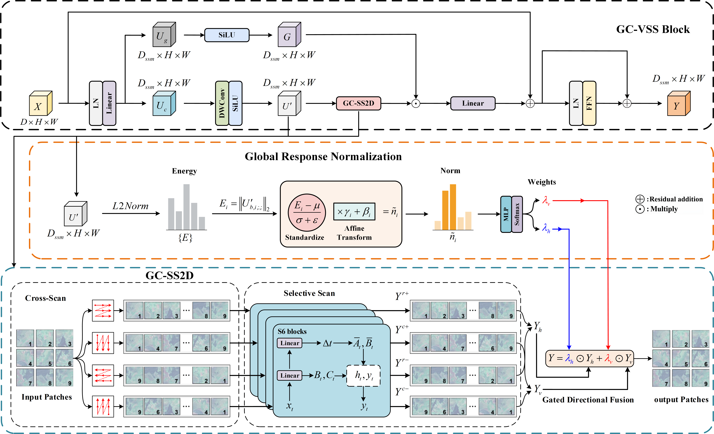

# GC-MambaWater Model

## Overview

This folder contains the **GC_MambaWater model** architecture. It is designed for users who wish to implement their own training logic, so the training entry script is intentionally excluded.

## Architecture Figures

Preview images are shown below. The original high-quality TIFF files are also kept in this folder.


### GC-VSS Block




## Included Files

1. `nets/gc_mambawater_mask2former_decoder.py`  
   Full decoder definition used by the complete model.

2. `nets/spcii_connect_blocks.py`  
   Contains only the SPCII and Connect blocks that are actually used by the full decoder.

3. `nets/gc_vss.py`  
   Contains the GC-VSS encoder implementation used by the model.

4. `nets/__init__.py`  
   Package marker for clean imports.

5. `prepare_voc_water_dataset.py`  
   Converts a raw image/mask dataset into the VOC-style folder structure used by this project.

6. `requirements.txt`  
   A compact dependency list with the most important Python packages.

7. `GC-MambaWater.tif`  
   Original TIFF figure of the overall GC-MambaWater architecture.

8. `GC-VSS Block.tif`  
   Original TIFF figure of the GC-VSS block.

9. `GC-MambaWater_preview.png`  
   PNG preview of the overall GC-MambaWater architecture for inline display.

10. `GC-VSS_Block_preview.png`  
   PNG preview of the GC-VSS block for inline display.

## Dataset Format Expected by the Original Project

```text
VOCdevkit/
    VOC2007/
        JPEGImages/
        SegmentationClass/
        ImageSets/
            Segmentation/
                train.txt
                val.txt
```

## Data Preparation

Use `prepare_voc_water_dataset.py` to build the VOC-style structure from raw images and masks.

Example:

```bash
python prepare_voc_water_dataset.py \
  --images-dir /path/to/images \
  --masks-dir /path/to/masks \
  --output-root /path/to/output \
  --val-ratio 0.1 \
  --seed 42
```

## Augmentation Note

The paper description about lightweight geometric augmentation
(rotation, scaling, and random cropping) corresponds to **online augmentation during training**,
not this preprocessing step.
